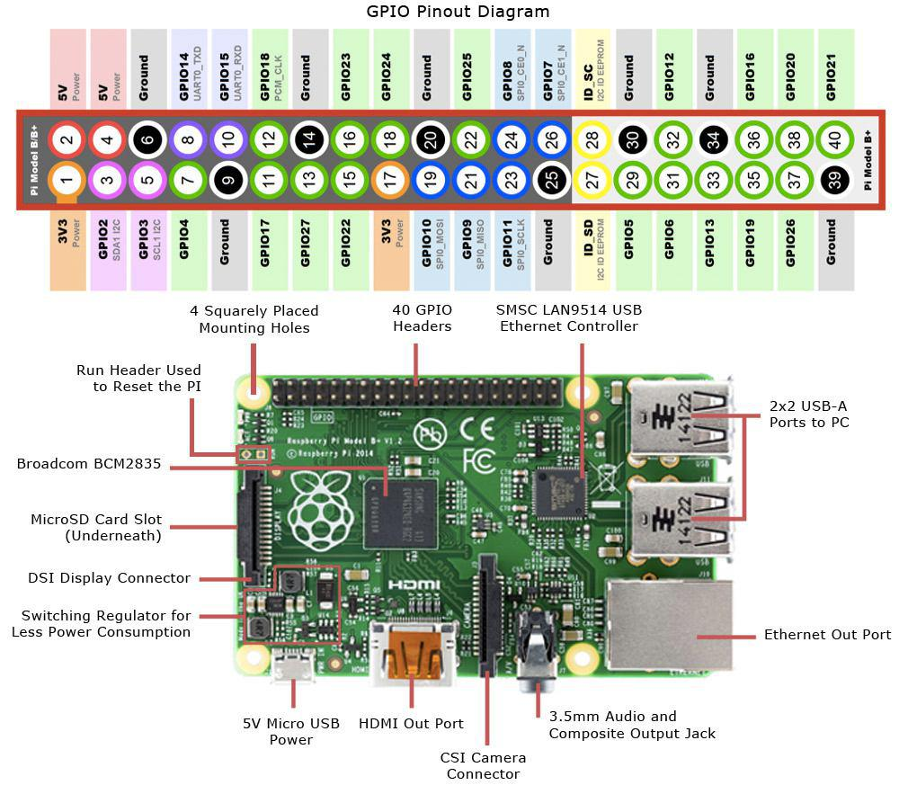
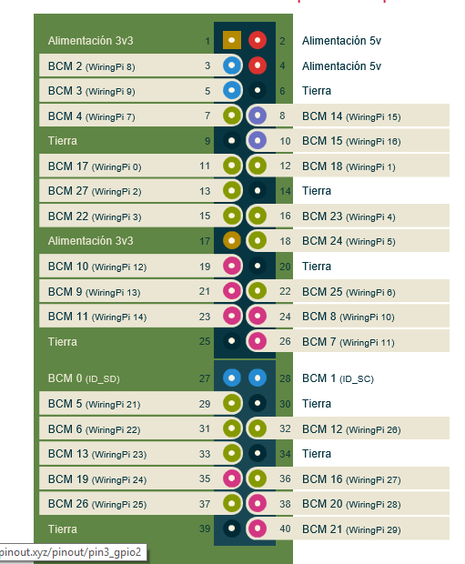

# POPBL-2-Piano
Desarrollo de un piano en lenguaje c. 

En un principio se ejecutara en windows pero para el producto final lo ejecutaremos en una maquina GNU/Linux (RaspBerry Pi 3).

#Pines de RaspBerryPi v3 B

#Pines de la Libreria WiringPi

